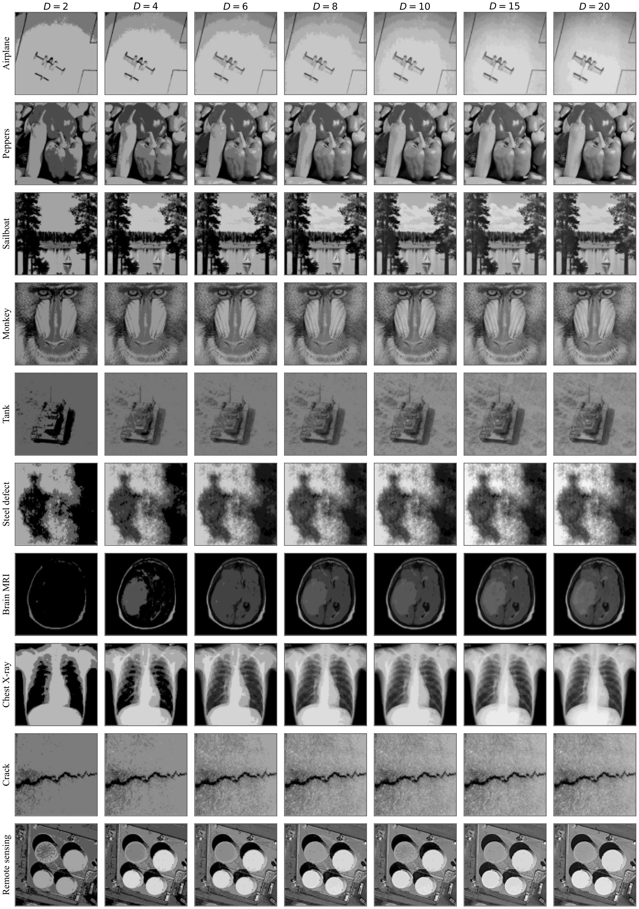

<div align="center">

<h1>AUGO</h1>

<p><b>Asymmetric Undulatory Growth Optimizer / 非对称波动生长优化器</b></p>

<p><i>Normalized evaluation progress as the single scheduling clock, driving three coordinated mechanisms</i></p>

<p>&nbsp;&nbsp;&nbsp;&nbsp;</p>

</div>


> **Manuscript status.** This repository is the reference implementation companion to a manuscript that is currently **under review** at a peer-reviewed journal. The journal name is withheld while the review is in progress. This page is provided for the editor and reviewers during the review process, and gives a high-level account of the method and its evaluation. The derivations, the full experimental protocols, and the complete result tables are given in the manuscript itself and are **deliberately not reproduced here**.


| | |
|:--|:--|
| **Manuscript** | AUGO: An Asymmetric Undulatory Growth Optimizer for Continuous Optimization |
| **Author** | **Qingke Zhang**\* |
| **Affiliation** | School of Computer Science and Artificial Intelligence, Shandong Normal University, Jinan 250358 |
| **Corresponding author** | [tsingke@sdnu.edu.cn](mailto:tsingke@sdnu.edu.cn) |
| **Status** | Under review — journal name withheld |


**Highlights**

- AUGO provides a progress-aware extension of the Growth Optimizer.
- Three coordinated mechanisms enhance exploration, escape, and refinement.
- AUGO ranks first on CEC2017 at 30D, 50D, and 100D among 31 algorithms.
- AUGO achieves the highest mean Kapur entropy on all ten test images.
- UAV experiments further demonstrate competitive feasibility and robustness.


## Contents

1. [Background and motivation](#1-background-and-motivation)
2. [Method overview](#2-method-overview)
3. [Key contributions](#3-key-contributions)
4. [Framework and mechanisms](#4-framework-and-mechanisms)
5. [Benchmark evaluation](#5-benchmark-evaluation)
6. [Application case studies](#6-application-case-studies)
7. [Reference implementation](#7-reference-implementation)
8. [Acknowledgments](#8-acknowledgments)


## 1. Background and motivation

Population-based metaheuristics attack continuous optimization problems that offer no usable gradient — nonlinear, nonconvex, multimodal, high-dimensional, or simply black-box problems. Their performance turns on one tension that no algorithm escapes: keeping enough diversity to survey the space, while intensifying around regions that have already proven promising. Since no optimizer wins across every problem class, the practical question is not which framework is best, but **how far an existing framework can be made to adapt**.

The **Growth Optimizer (GO)** is the baseline this work builds on. GO frames continuous optimization as a cooperative *learning–reflection* process: individuals are stratified by fitness, the learning stage constructs knowledge increments from gap information among them, and the reflection stage adjusts selected dimensions to sharpen local exploitation. The framework is compact and carries few control parameters — but its reference selection, reflection regulation, and late-stage search are only **weakly coupled to how far the search has actually progressed**, which becomes restrictive on complex multimodal and high-dimensional landscapes.

Three specific limitations follow from that weak coupling:

- **Fixed reference pools.** Reference individuals are drawn from ranking intervals that stay fixed for the entire run, so selection pressure barely changes across stages.
- **Undirected random resetting.** Reflection may reassign a dimension a value drawn uniformly from the whole search space, discarding what the search has learned about promising regions.
- **Insufficient local refinement.** There is no dedicated procedure for refining elite regions or the neighbourhood of the current global-best solution.

<p align="center">
  
</p>

<p align="center">
  <em><b>Figure 1.</b> Conceptual correspondence between the limitations of GO, the proposed AUGO mechanisms, and their intended search effects.</em>
</p>

AUGO addresses these three limitations without altering the basic learning–reflection structure. Its search behaviour is regulated by a single quantity — normalized function-evaluation progress — so that reference selection, reflection and escape, and local refinement all shift together as the budget is consumed.


## 2. Method overview

AUGO keeps the population initialization, boundary handling, greedy selection, and growth-update principles of GO intact. Three mechanisms are layered onto different parts of the original search process, and all three are scheduled by the same normalized progress variable.

**UADSAP** — Undulatory Annealing Dynamic State-Aware Pool — regulates *where reference individuals are drawn from*. Its sampling bounds are driven by an undulatory annealing factor that decays smoothly across the run. Early on the pools are wide, so individuals learn from a broad cross-section of the population; as the run proceeds both pools contract toward the top-ranked and bottom-ranked individuals respectively, concentrating the guidance.

**AT-CQ** — Asymmetric Time-varying Reflection and Cauchy Quantum Escape — regulates *how reflection behaves*. Instead of resetting a dimension to a uniformly sampled value, reflection moves it toward the corresponding coordinate of a superior reference individual, weighted by a time-varying factor whose expected magnitude shrinks as the run progresses. A separate escape event, whose activation probability decays over the run, occasionally replaces the guided value — sometimes with a uniform reset, sometimes with a heavy-tailed perturbation scaled by the distance to the current global best.

**UDGF** — Unified Differential-Gaussian Field — supplies *late-stage local refinement* at two levels. The first subprocess perturbs elite individuals along population-difference vectors with dimension-wise Gaussian noise and a contracting scale. The second performs a budget-constrained search around the current global-best solution, restricted to a randomly activated subset of coordinates. The global-best neighbourhood search is switched off during the first 20% of the budget and draws on a bounded share of the remaining evaluations thereafter.

The design intent is that the three mechanisms **do not compete for the same evaluations**. UADSAP changes what the learning stage is told, AT-CQ changes how reflection corrects, and UDGF adds refinement the original framework never had — each operating on a different component, all reading the same progress clock.

<p align="center">
  
</p>

<p align="center">
  <em><b>Figure 2.</b> Stage-wise schedules of the three mechanisms, under N = 40, ρ<sub>p</sub> = 0.5, p<sub>q</sub><sup>max</sup> = 0.10, η<sub>B</sub> = 0.20, MaxFEs = 300,000. (a) Dynamic superior and inferior reference pools. (b) Expected AT-CQ reflection weight with its 10th–90th percentile interval. (c) Conditional escape probability and the effective per-dimension probability. (d) Coarse-to-fine UDGF perturbation scales and activation of the global-best neighbourhood refinement.</em>
</p>

The four panels above are the clearest single view of the design: every schedule moves in the same direction — from broad to focused — and every one is indexed by the same progress variable.


## 3. Key contributions

- **A progress-aware extension that preserves the original framework.** AUGO retains GO's learning–reflection structure and regulates its search behaviour through normalized function-evaluation progress. Rather than adding a learned decision policy, it uses budget consumption as the scheduling signal, at no extra learning cost.

- **Three mechanisms that map onto three identified limitations.** UADSAP resolves the fixed-pool limitation, AT-CQ the undirected-resetting limitation, and UDGF the missing-refinement limitation. Together they establish a progressive search architecture rather than a set of independent add-ons.

- **A large-scale comparative evaluation with ablation and sensitivity evidence.** AUGO is compared against 30 baseline algorithms — including the original GO — on the CEC2017 suite at three dimensions under identical evaluation budgets, with the contribution of each mechanism isolated by leave-one-out ablation rather than assessed as a monolith.

- **Transfer to two structurally different application problems.** The same implementation is applied without task-specific redesign to Kapur-entropy multilevel image thresholding and to constrained three-dimensional UAV path planning — problems whose decision structures, feasibility conditions, and objective landscapes differ substantially from CEC benchmarks.


## 4. Framework and mechanisms

AUGO terminates on an evaluation budget rather than a fixed iteration count, which is what allows every schedule in the method to be written as a function of progress. The flowchart gives the control flow: UADSAP regulates dynamic sampling of the superior and inferior reference individuals, AT-CQ performs guided reflection and probabilistic escape, and UDGF then runs its two complementary refinement operations — with the global-best neighbourhood search activated only once 20% of the budget has been consumed and constrained by the remaining budget thereafter.

<p align="center">
  
</p>

<p align="center">
  <em><b>Figure 3.</b> Overall workflow of AUGO and the interaction among UADSAP, AT-CQ, and UDGF.</em>
</p>

Two properties of this composition are worth stating at the architectural level, with the formal treatment left to the manuscript.

**The three mechanisms act on disjoint components.** UADSAP changes the reference pools that feed the learning stage, AT-CQ changes the reflection update and its escape behaviour, and UDGF adds refinement operations that sit after the growth update. No two mechanisms modify the same equation, so the composition is additive rather than entangled — each can be ablated cleanly, and the ablation study in the manuscript confirms that all three contribute.

**The extension does not raise the asymptotic cost.** The added work per cycle is constant-factor only: reference-pool regulation and index sampling are scalar operations, and the refinement subprocesses operate on a fixed number of trials and a bounded share of the budget. The overall time complexity remains the same asymptotic order as the original GO, and the core storage requirement is unchanged at linear in population size and dimension. The mechanism set therefore buys adaptivity without buying a higher growth rate.


## 5. Benchmark evaluation

| | |
|:--|:--|
| Benchmark | CEC2017 single-objective suite, F1–F30 (unimodal, simple multimodal, hybrid, and composition groups), search range [−100, 100] |
| Dimensions | 30, 50, 100 |
| Comparison set | 31 algorithms — AUGO plus 30 baselines spanning evolutionary, swarm, physics-, mathematics-, and human-behaviour-inspired families, including the original GO |
| Protocol | Identical evaluation budget per dimension, uniform random initialization, 20 independent runs per algorithm per function |
| Statistical analysis | Two-sided Wilcoxon rank-sum test for pairwise significance; Friedman rank test for overall ranking; α = 0.05 |
| Headline result | AUGO ranked **first at all three dimensions** (mean Friedman rank 4.557); the closest competitor at every dimension is the original GO |

Against the original GO the picture improves with dimensionality, and the most pronounced advantage appears on the simple multimodal group. The gains are **not universal**: GO retains a significant advantage on a small number of functions, which is consistent with a mechanism set that changes how the search is *scheduled* rather than what the search can represent. The manuscript reports the per-function comparisons, the ablation study, and the single-factor parameter sensitivity analysis in full; both the ablation and the sensitivity results support the design — no mechanism is redundant, and the algorithm does not require highly specific parameter settings to remain competitive within the tested ranges.


## 6. Application case studies

Benchmarks measure solution quality under a fixed protocol. They do not test whether an optimizer can be dropped into a problem whose decision structure, feasibility conditions, and objective landscape are set by someone else. AUGO is therefore applied — with no task-specific redesign of the search core — to two such problems.

### Kapur-entropy multilevel image thresholding

Each candidate solution is an ordered set of gray-level thresholds, scored by the Kapur entropy summed over the regions the thresholds induce. The objective is maximized and difficulty grows with the threshold count. Ten grayscale images are used — five classical benchmarks and five application-oriented images — across threshold counts from 2 to 20, with 20 independent runs each, compared against five other algorithms. The reported fidelity measures quantify **reconstruction fidelity, not semantic segmentation accuracy**, which is an important distinction when reading them.

AUGO obtains the highest mean final entropy on all ten images at every tested threshold count from 8 onward; at the lowest threshold counts the leading algorithms converge to nearly identical entropy, as expected when the objective landscape is comparatively smooth. The advantage in final entropy therefore **emerges as the problem becomes harder**, rather than being uniform across the range. Because the fidelity measures are computed from the threshold vector that maximizes Kapur entropy, they need not be jointly optimal — the evidence supports strong competitiveness on the objective actually being optimized, not across-the-board superiority on every metric.

<p align="center">
  
</p>

<p align="center">
  <em><b>Figure 4.</b> Twenty-threshold Kapur reconstructions produced by AUGO across the test set.</em>
</p>

### Constrained three-dimensional UAV path planning

Ten intermediate waypoints give a 30-dimensional decision vector with coordinates constrained to a bounded region. A shared decoding chain maps any candidate to a flyable trajectory — waypoints ordered by projected progress, joined by piecewise cubic Hermite interpolation, resampled uniformly by arc length, and deterministically repaired to satisfy the terrain-clearance requirement. Every compared algorithm uses this same decoder, so the comparison isolates the search itself. The cost combines path length, terrain clearance, smoothness, obstacle and threat penalties, turn and climb feasibility, and altitude variation, with a large penalty added whenever any violation count is non-zero.

Four deterministic scenarios of increasing constraint complexity are used, with 30 independent runs each and a matched random seed across algorithms. Objectives are evaluated with a modest number of arc-length samples during optimization, and every selected solution is then re-validated deterministically with a far denser sample set; a path counts as successful only when all violation counts are zero. Significance is assessed with an exact paired McNemar test for success rates and an exact paired sign test for cost and length, with Holm correction within each test family.

AUGO produces the highest pooled success rate and the lowest mean paired rank of the six algorithms compared. At the scenario level it is strongest where the problem is hardest and most open, and it is one of only two algorithms to produce paths that survive dense validation in the most severely restricted scenario. These advantages are **not uniform**, and the manuscript reports where they do not hold: AUGO does not reach full feasibility, it is outperformed by individual competitors on specific scenarios and on individual metrics such as median cost, and one competitor achieves a significantly lower cost than AUGO in one scenario after correction. What the experiment supports is that AUGO delivers competitive, robust performance under dense deterministic validation and is particularly effective in the harder, more open scenarios — not that it dominates every scenario on every metric.

<p align="center">
  
</p>

<p align="center">
  <em><b>Figure 5.</b> Representative feasible paths across the four scenarios, illustrating typical path geometry.</em>
</p>


## 7. Reference implementation

The reference implementation is a single self-contained MATLAB function with no external dependencies beyond the caller-supplied objective. It accepts two argument layouts, detected automatically: an 11-argument benchmark interface and an 8-argument segmentation interface.

```matlab
% --- Benchmark interface (CEC / PlatECO) -------------------------------
% AUGO(mainHandle, popsize, dimension, xmax, xmin, vmax, vmin, ...
%      maxiter, Func, FuncId, VisualSwitch)
[gbestX, gbestfitness, gbesthistory] = AUGO( ...
    [], 40, 30, 100, -100, [], [], 7500, @myObjective, 1, false);

% --- Segmentation interface -------------------------------------------
% AUGO(popsize, dimension, maxiter, xmax, xmin, probR, Func, Class)
% The objective is maximized internally, so Func returns the Kapur entropy.
[gbestX, gbestfitness, gbesthistory] = AUGO( ...
    40, D, 150, 255, 0, probR, @kapurObjective, imageClass);
```

The full source is [`AUGO.m`](AUGO.m) at the repository root, with the complete default parameters documented inline. The benchmark protocol uses an initial population size of `N = 40`.


## 8. Acknowledgments

The author thanks the editor and the anonymous reviewers for their time and their detailed comments, which have improved the manuscript. Funding information will be recorded here in accordance with the manuscript once the review process concludes.


## Copyright

Copyright (c) 2026 Qingke Zhang. All rights reserved.

The source code `AUGO.m` is released under the [MIT License](LICENSE). The manuscript, figures, and documentation in this repository remain the property of the author and may not be redistributed without permission. The companion manuscript is currently under review; until the citation record is updated, please cite this work as a manuscript under review. See [NOTICE.md](NOTICE.md) for details.


<div align="center">
<sub>School of Computer Science and Artificial Intelligence, Shandong Normal University</sub>
</div>
