<div align="center">

<h1>AUGO</h1>

<p><b>非对称波动生长优化器 / Asymmetric Undulatory Growth Optimizer</b></p>

<p><i>以归一化评估进度为唯一调度时钟，驱动三个协同机制</i></p>

<p>&nbsp;&nbsp;&nbsp;&nbsp;</p>

</div>


> **论文状态说明。** 本仓库是配套论文的参考实现与说明文档。该论文目前正在某同行评审期刊**投审稿阶段**，评审期间不公开期刊名称。仓库中的代码、图表与文档描述的是投稿版本，评审结束后可能修订。


| | |
|:--|:--|
| **论文题目** | AUGO: An Asymmetric Undulatory Growth Optimizer for Continuous Optimization |
| **作者** | **张庆科**\* |
| **单位** | 山东师范大学 计算机与人工智能学院，济南 250358 |
| **通讯作者** | [tsingke@sdnu.edu.cn](mailto:tsingke@sdnu.edu.cn) |
| **状态** | 投审稿中 —— 期刊名称暂不公开 |


**研究亮点**

- AUGO 为生长优化器提供了进度感知的扩展。
- 三个协同机制分别强化探索、逃逸与精炼能力。
- 在 31 个算法中，AUGO 于 CEC2017 的 30D、50D、100D 均排名第一。
- AUGO 在全部十幅测试图像上取得最高平均 Kapur 熵。
- 无人机实验进一步验证了其竞争力与鲁棒性。


## 目录

1. [研究背景与动机](#1-研究背景与动机)
2. [方法概述](#2-方法概述)
3. [主要贡献](#3-主要贡献)
4. [框架与机制](#4-框架与机制)
5. [基准测试评估](#5-基准测试评估)
6. [应用案例研究](#6-应用案例研究)
7. [参考实现](#7-参考实现)
8. [致谢](#8-致谢)


## 1. 研究背景与动机

基于种群的元启发式算法所处理的连续优化问题往往无法提供可用的梯度——问题可能是非线性的、非凸的、多峰的、高维的，或者干脆是黑箱的。这类算法的性能取决于一个任何算法都无法回避的矛盾：既要保持足够的多样性以勘察整个空间，又要在已经证明有希望的区域附近加强搜索。由于不存在能在所有问题类别上取胜的优化器，实践中的问题不是哪个框架最好，而是**一个已有框架能被改造到何种自适应程度**。

**生长优化器（Growth Optimizer, GO）** 是本文工作的 baseline。GO 将连续优化刻画为一个协同的*学习—反思*过程：个体按适应度分层，学习阶段依据个体间的差距信息构造知识增量，反思阶段则调整被选中的维度以强化局部开发。该框架结构紧凑、控制参数少。但它的参考个体选择、反思调节与后期搜索，都只与搜索的实际推进程度**弱耦合**，这在复杂的多峰与高维地形上会形成限制。

这种弱耦合带来三个具体缺陷：

**参考池固定。** GO 从整个运行期间保持不变的排序区间中采样优解与劣解参考个体。选择压力因此在不同阶段几乎不变——早期可能损失多样性，后期又无法让搜索方向充分集中。

**无向随机重置。** 反思阶段可能将被选维度重新赋为在整个搜索空间上均匀抽取的值。这恢复了多样性，却丢弃了搜索已经获得的关于有希望区域的全部信息。在运行的后期，这种无引导重置消耗评估次数却不改进解，还可能破坏原本有效的种群结构。

**局部精炼不足。** GO 没有专门用于精炼精英区域或当前全局最优解邻域的过程。一旦种群落入某个有希望的盆地，基于差距的学习与逐维反思都过于粗糙，无法继续提升精度。

<p align="center">
  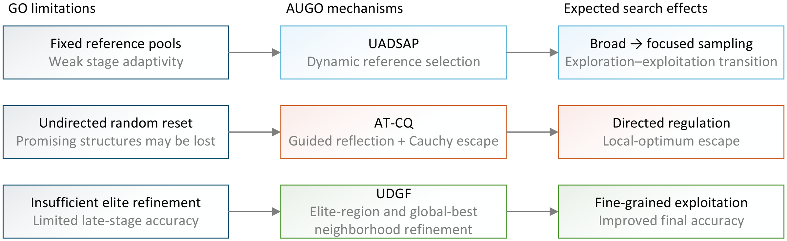
</p>

<p align="center">
  <em><b>图 1.</b> GO 的局限、所提出的 AUGO 机制及其预期搜索效果之间的概念对应关系。</em>
</p>

AUGO 在不改变 GO 基本学习—反思结构的前提下应对上述三个缺陷。它的搜索行为由**单一量**调节——归一化函数评估进度——从而使参考选择、反思与逃逸、局部精炼三者随预算消耗同步变化。

<p align="center">
  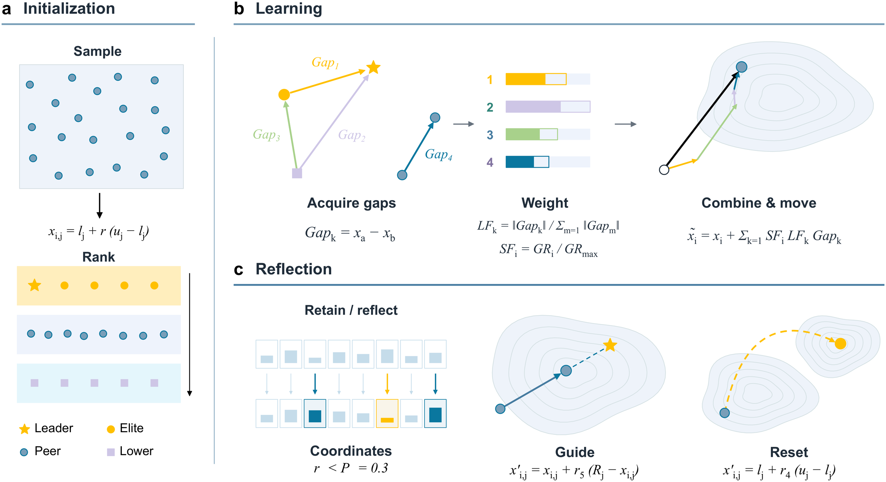
</p>

<p align="center">
  <em><b>图 2.</b> AUGO 所基于的生长优化器学习—反思原理。</em>
</p>


## 2. 方法概述

AUGO 完整保留了 GO 的种群初始化、边界处理、贪婪选择与生长更新原理，仅在原搜索过程的不同环节上叠加了三个机制。三者由同一个归一化进度变量 `τ(t) = t / T` 调度，其中 `t` 为已消耗的函数评估次数（含初始化），`T` 为评估预算。

**UADSAP**——波动退火动态状态感知池（Undulatory Annealing Dynamic State-Aware Pool）——调节*参考个体从何处抽取*。波动退火因子 `α(t) = (cos(πτ(t)) + 1) / 2` 从接近 1 平滑衰减至 0，驱动优解池与劣解池的采样边界。运行早期两个池都很宽，个体从种群的广泛横截面中学习；随着运行推进，两个池分别向排名最前与最后的个体收缩，使引导信息更加集中。

**AT-CQ**——非对称时变反思与柯西量子逃逸（Asymmetric Time-varying Reflection and Cauchy Quantum Escape）——调节*反思如何行为*。它不再把某个维度重置为均匀采样值，而是将该坐标朝某个优解参考个体的对应坐标移动，并以一个期望幅度随时间递减的时变因子加权。另有独立的逃逸事件，其激活概率由 `p_q^max` 衰减至 0.01，触发后以等概率取代引导值——一半概率为均匀重置，一半概率为以到当前全局最优解的距离为尺度的柯西重尾扰动。

**UDGF**——统一差分—高斯场（Unified Differential-Gaussian Field）——在两个层面上提供*后期局部精炼*。第一个子过程沿种群差分向量、叠加逐维高斯噪声与收缩因子 `(1 − τ(t))` 扰动精英个体；第二个子过程在当前全局最优解周围执行预算受限的搜索，对以概率 0.25 逐维激活的掩码施加部分维高斯/柯西扰动。全局最优邻域搜索在预算前 20% 内关闭，其后只占用剩余评估次数的有界份额。

设计的着眼点在于三个机制**不争夺同一批评估次数**：UADSAP 改变学习阶段接收到的信息，AT-CQ 改变反思的修正方式，UDGF 补上原框架从未具备的精炼能力——各自作用于不同组件，却共同读取同一个进度时钟。


## 3. 主要贡献

**一个保留原框架的进度感知扩展。** AUGO 保留 GO 的学习—反思结构，通过归一化函数评估进度调节其搜索行为。它不引入学习型决策策略，而是以预算消耗作为调度信号——使参考选择、反思与逃逸、局部精炼同步变化，且不带来额外的学习开销。

**三个机制，对应三个已识别的缺陷。** UADSAP 随搜索推进收缩按适应度排序的参考池，解决 GO 的固定池缺陷；AT-CQ 将带引导的时变反思与递减的重尾逃逸耦合，解决无向重置缺陷；UDGF 引入精英区域的差分—高斯精炼以及预算受限的全局最优邻域搜索，解决缺失精炼的缺陷。三者共同构成一套渐进式搜索架构。

**一次包含消融与敏感性证据的大规模对比评估。** AUGO 在相同评估预算下，于 CEC2017 测试集的 30、50、100 维上与 **30 个基线算法**（含原始 GO）对比，采用收敛性分析、Wilcoxon 与 Friedman 非参数检验、单因素参数敏感性分析以及留一法消融。消融实验单独分离出每个机制的贡献，而非把设计当作一个整体来评估。

**向两个结构迥异的应用问题迁移。** 同一份实现未经任务特定的重新设计，即被应用于 Kapur 熵多阈值图像分割与带约束的三维无人机路径规划——这两个问题的决策结构、可行性条件与目标地形都与 CEC 基准有本质差异。


## 4. 框架与机制

AUGO 以评估预算而非固定迭代次数作为终止条件，因此下文所有调度均写为 `τ(t)` 的函数。流程图给出控制流：UADSAP 调节优解与劣解参考个体的动态采样，AT-CQ 执行带引导的反思与概率性逃逸，随后 UDGF 执行两个互补的精炼操作——其中全局最优邻域搜索仅在 `τ(t) > 0.2` 后激活，并受剩余预算约束。

<p align="center">
  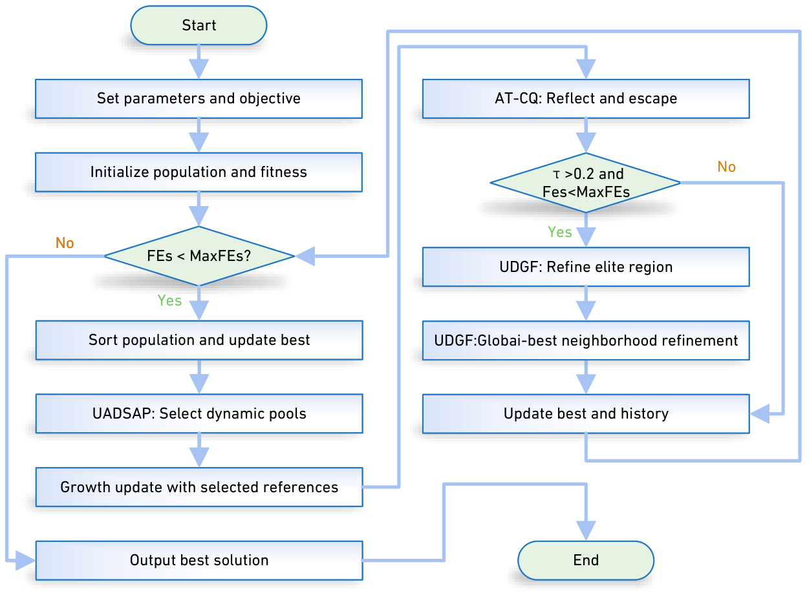
</p>

<p align="center">
  <em><b>图 3.</b> AUGO 的整体流程及 UADSAP、AT-CQ、UDGF 三者的交互关系。</em>
</p>

<p align="center">
  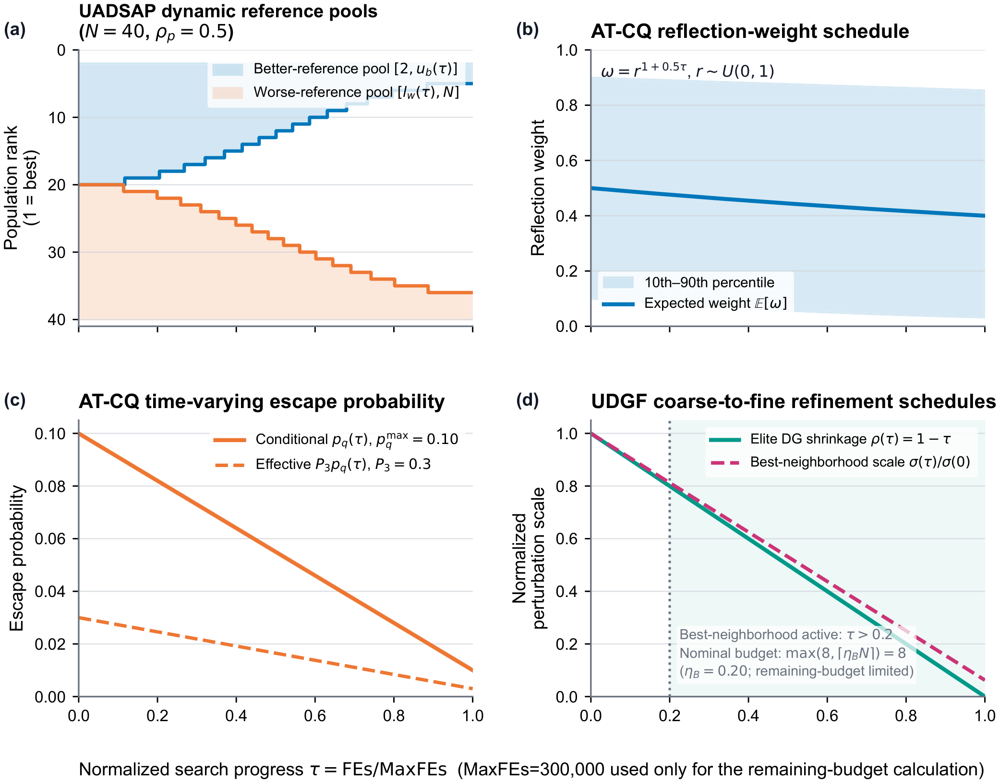
</p>

<p align="center">
  <em><b>图 4.</b> 三个机制的阶段式调度，参数为 N = 40、ρ<sub>p</sub> = 0.5、p<sub>q</sub><sup>max</sup> = 0.10、η<sub>B</sub> = 0.20、MaxFEs = 300,000。(a) 动态优解池与劣解池；(b) AT-CQ 期望反思权重及其 10–90 百分位区间；(c) 条件逃逸概率 p<sub>q</sub>(t) 与逐维有效概率 P<sub>3</sub>p<sub>q</sub>(t)；(d) UDGF 由粗到细的扰动尺度与全局最优邻域精炼的激活情况。</em>
</p>

上面四幅子图是理解该设计最直观的一处：每条调度曲线都朝同一方向变化——由宽到窄、由粗到细——且都以同一个进度变量为索引。

**UADSAP：收缩的参考池。** 波动退火因子 `α(t) = (cos(πτ(t)) + 1) / 2` 从接近 1 平滑衰减至 0，据此设定优解池的动态上界

```
u_b(t) = round( 5 + (u_max − 5)·α(t) ),   u_max = max(5, round(ρ_p·N))
```

与劣解池的动态下界

```
l_w(t) = round( (N − 4) − [ (N − 4) − l_min ]·α(t) ),   l_min = min(N − 4, round(ρ_p·N))
```

其中 `ρ_p` 为参考池排序边界比例，除特别说明外固定为 0.5。优解参考个体随后从排名 `2 … u_b(t)` 中均匀采样——从排名 2 起算，是因为排名 1 即当前最优解，否则它既作为最优解又作为自身的参考。劣解参考个体从排名 `l_w(t) … N` 中采样。运行早期两个池都很宽，学习阶段因此能利用种群的广泛横截面；随着 `α(t)` 下降，`u_b(t)` 趋近 5、`l_w(t)` 趋近 `N − 4`，两个池同时向极端排名集中，基于差距的引导随之变得锐利。

**AT-CQ：带引导的反思与衰减逃逸。** 当反思在个体 `i` 的第 `j` 维上触发时，该坐标朝某个优解参考个体移动，而非跳到随机值：

```
x_{i,j}^{t+1} = x_{i,j}^t + ( x_{R,j}^t − x_{i,j}^t )·ω(t),   ω(t) = r^{1 + 0.5τ(t)},  r ~ U(0,1)
```

由于指数 `1 + 0.5τ(t)` 随进度增长，期望权重 `E[ω(t)] = 1 / (2 + 0.5τ(t))` 与各分位数 `Q_p[ω(t)] = p^{1 + 0.5τ(t)}` 均单调收缩——反思在运行后期趋于保守。在进入反思分支的条件下，逃逸事件以如下概率触发

```
p_q(t) = 0.01 + ( p_q^max − 0.01 )·( 1 − τ(t) )
```

从 `p_q^max = 0.10` 衰减至 0.01。一旦触发，逃逸以等概率解析为两种之一：均匀随机重置 `x_{i,j}^{t+1} = lb_j + (ub_j − lb_j)·r`，或围绕当前全局最优解的柯西重尾扰动

```
x_{i,j}^{t+1} = x_{best,j}^t + tan[ π(r − 0.5) ]·| x_{best,j}^t − x_{i,j}^t |
```

其幅度以到全局最优解的距离为尺度。两种逃逸分支互斥，且都会覆盖原引导值。由于反思分支本身以概率 `P_3` 触发，某个维度上保持不变的**逐维有效**概率分别为：不变 `1 − P_3`、保留引导更新 `P_3[1 − p_q(t)]`、均匀重置 `0.5·P_3·p_q(t)`、柯西扰动 `0.5·P_3·p_q(t)`。

**UDGF：两级局部精炼。** 精英区域子过程由两个不同的种群个体构造差分向量 `v^t = x_{r1}^t − x_{r2}^t`，并沿该方向扰动一个精英基个体：

```
u^t = x_base^t + ε^t ⊙ v^t·( 1 − τ(t) ),   ε^t ~ N(0, I)
```

因此各维扰动的尺度与观测到的种群差分挂钩，而非来自独立的随机位移，并随 `(1 − τ(t))` 的下降而收缩。贪婪选择仅在严格改进时替换基个体。

全局最优邻域子过程占用一份有界预算：

```
B(t) = 0                                          if τ(t) ≤ 0.2
     = min( max(8, ceil(η_B·N)), T − t )          if τ(t) > 0.2
```

其中 `η_B = 0.20`；`T − t` 一项可避免精炼超出评估预算。其扰动尺度为 `σ(t) = (ub − lb)·[0.06(1 − τ(t)) + 0.004]`，仅施加于由 Bernoulli(0.25) 掩码激活的坐标上，且扰动以概率 0.75 为高斯、以概率 0.25 为柯西——保留重尾是为了让局部搜索内部仍可能出现偶发的较大偏移：

```
ε_j(t) = N(0, σ²(t))                        with probability 0.75
       = 0.5·σ(t)·tan[ π(r − 0.5) ]         with probability 0.25
u_j = x_{best,j}^t + m_j·ε_j(t)
```

同样施加贪婪选择，因此全局最优解不会被劣化。

**计算复杂度。** 记种群规模 `N`、维度 `D`、评估预算 `T`，单次目标评估代价为 `C_f(D)`。每个周期内种群至多排序三次。UADSAP 自身开销为标量级的参考池调节与索引采样，可忽略。学习阶段与 AT-CQ 阶段各处理 `N` 个候选、均为 `O(ND)`，精英区域子过程生成固定的 `K = 5` 个试验解、为 `O(KD)`，邻域子过程处理 `B_i` 个候选、为 `O(B_i·D)`。因此在不计目标评估时，一个完整周期的代价为

```
O( N log N + (2N + K + B_i)·D )
```

每个周期至少消耗 `2N + K` 次评估，故完整周期数上界为 `I_AUGO = O(T / N)`，累计排序代价为 `O(T log N)`。整体时间复杂度为

```
C_AUGO = O( T·C_f(D) + T·D + T·log N ) = O( T·( C_f(D) + D + log N ) )
```

**与原版 GO 处于同一渐近阶**——三个机制带来的是常数因子级的工作量，而非更高的增长阶。若不计目标评估，内部代价为 `O(T(D + log N))`。核心存储为 `O(ND + N + D) = O(ND)`；实验实现为记录收敛曲线额外需要 `O(T)`，合计 `O(ND + T)`。


## 5. 基准测试评估

AUGO 在 CEC2017 单目标测试集上评估——函数 F1–F30，覆盖单峰（F1–F3）、简单多峰（F4–F10）、混合（F11–F20）与复合（F21–F30）四类，搜索范围均为 [−100, 100]，适应度误差相对已知最优解计算。

**实验设置。** 维度 30、50、100；各维度下种群规模均为 `N = 40`；评估预算 `MaxFEs = 10000·D`（300,000 / 500,000 / 1,000,000）；均匀随机初始化；每种算法每个函数独立运行 20 次。对比采用双侧 Wilcoxon 秩和检验做两两显著性分析、Friedman 秩检验做整体排名，显著性水平均为 `α = 0.05`。AUGO 与 **30 个基线算法**（合计 31 个算法）对比，涵盖进化计算、群体智能、物理与数学启发、人类行为启发、生物与生化启发等类别，提出年份从 1975 年跨至 2025 年，其中包含原始生长优化器。

### 整体排名

| 设置 | AUGO 的 Friedman 平均秩 | 名次 |
|:--|:--:|:--:|
| CEC2017 @ 30D | 4.940 | 第 1 |
| CEC2017 @ 50D | 4.070 | 第 1 |
| CEC2017 @ 100D | 4.660 | 第 1 |
| **三维度平均** | **4.557** | **31 个算法中第 1** |

AUGO 在三个维度设置下均取得最优的 Friedman 平均秩，并以 4.557 的整体平均秩在全部 31 个算法中位列第一。各维度下最接近的竞争者都是原始 GO，其平均秩为 5.133；其后依次为 JADE（7.277）、GSK（7.900）与 CEO（10.463）。优势在整个算法群体中分布**并不均匀**——与 GO 的差距真实存在但幅度温和，而相当长的一段尾部算法则远远落后。

### 与原始 GO 的两两对比

| 维度 | 胜 / 平 / 负（对 GO） |
|:--|:--:|
| 30D | 10 / 13 / 7 |
| 50D | 10 / 15 / 5 |
| 100D | 15 / 13 / 2 |
| **90 个「函数–维度」组合合计** | **35 / 41 / 14** |

面对 GO，AUGO 的表现随维度升高而改善：在 100D 下胜 15 个函数、平 13 个、仅负 2 个。优势最明显的是简单多峰组，AUGO 在其中 7 个函数里有 6 个显著优于 GO。但 GO 在 F14 与 F22 上仍保有显著更优的表现——**提升并非普适**，这与「机制改变的是搜索的调度方式、而非搜索的表达能力」这一设计定位是一致的。

<p align="center">
  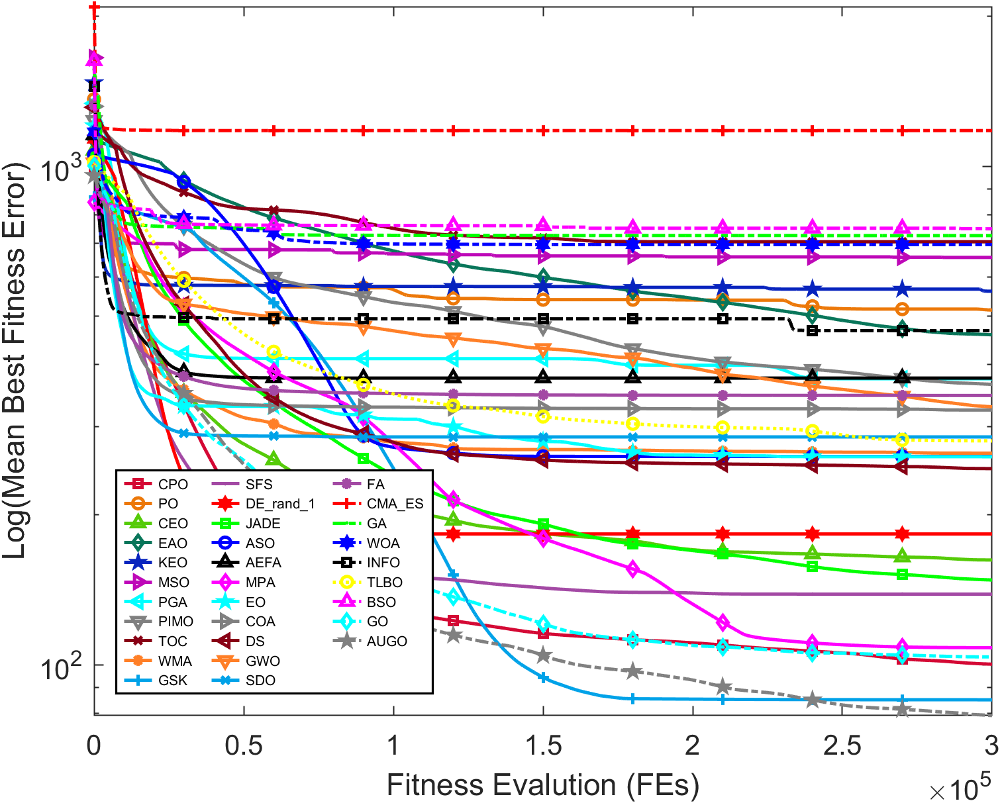
</p>

<p align="center">
  <em><b>图 5.</b> 30D 下 CEC2017 F20（混合函数）在 20 次独立运行上的平均收敛曲线。在该维度下，AUGO 于 F20 与 F30 取得 31 个算法中最优的最终平均误差。</em>
</p>

<p align="center">
  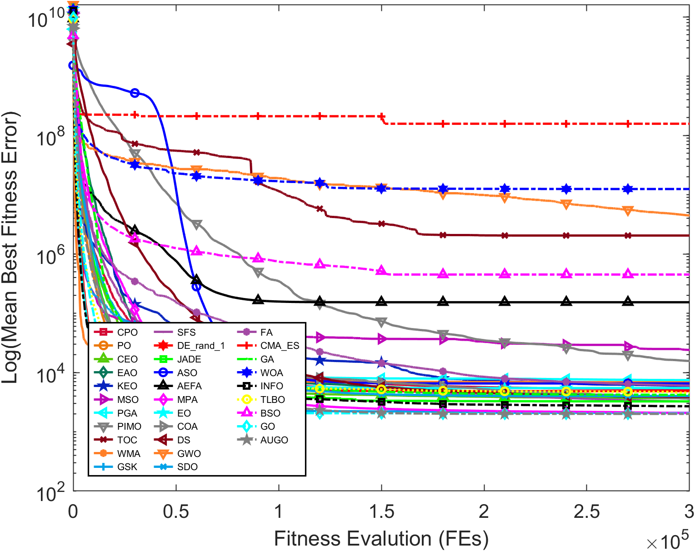
</p>

<p align="center">
  <em><b>图 6.</b> 30D 下 CEC2017 F30（复合函数）的平均收敛曲线。复合函数正是后期精炼机制预期最应发挥作用的函数类别。</em>
</p>

<p align="center">
  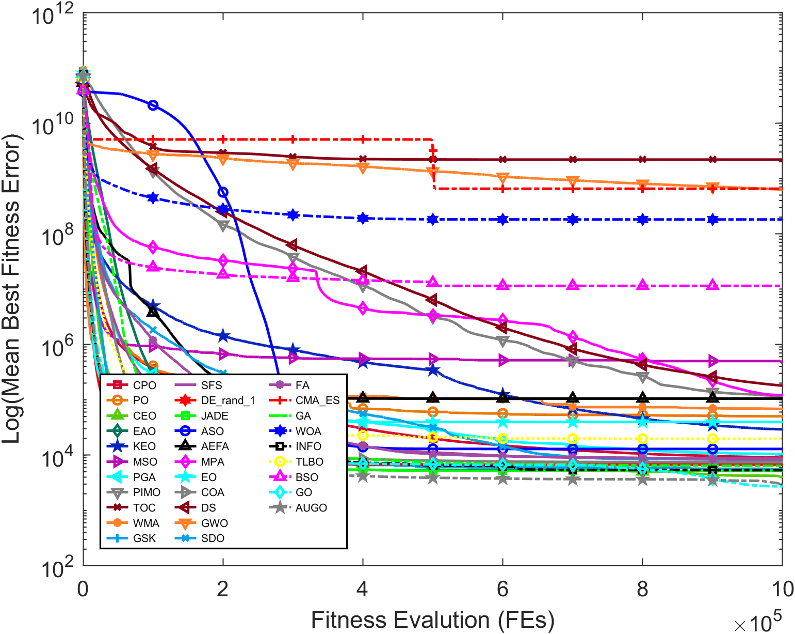
</p>

<p align="center">
  <em><b>图 7.</b> 100D 下 CEC2017 F30 的平均收敛曲线。在该维度下，AUGO 对 GO 胜 15 个函数、平 13 个、仅负 2 个。</em>
</p>

<p align="center">
  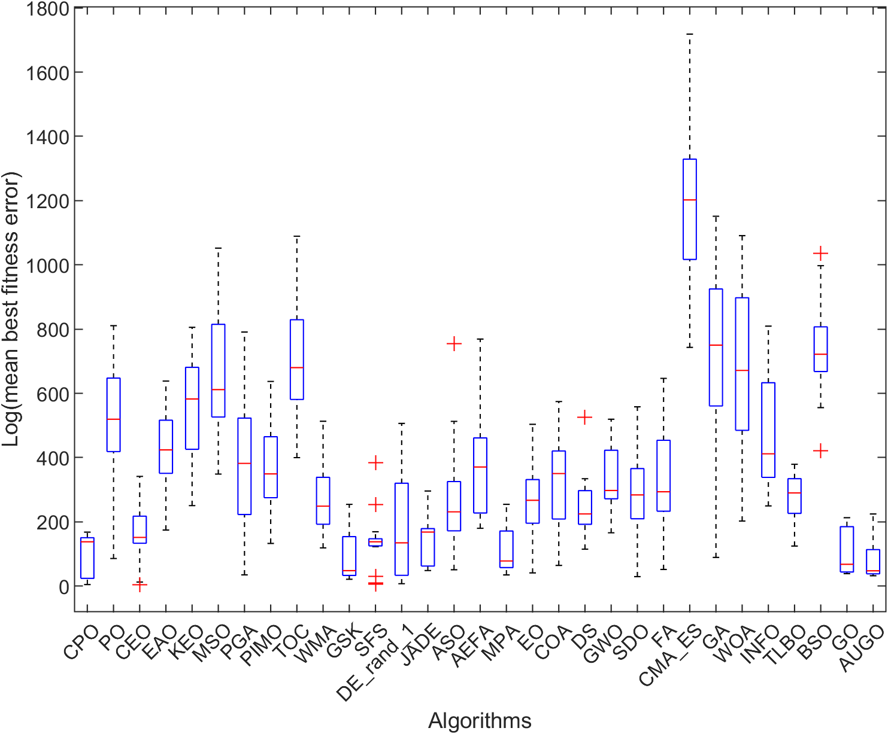
</p>

<p align="center">
  <em><b>图 8.</b> 30D 下 CEC2017 F20 在 20 次运行中的最终误差分布。箱线图反映的是运行间的离散程度，而不仅是平均行为。</em>
</p>

### 消融实验

三个留一法变体在相同的 CEC2017 30D 协议下运行。下表的胜/平/负计数相对于**完整 AUGO** 而言——即统计 AUGO 显著优于、无显著差异于、以及显著劣于该变体的函数个数。

| 变体 | 最优均值次数 | +/≈/−（相对 AUGO） | Friedman 平均秩 |
|:--|:--:|:--:|:--:|
| **AUGO（完整）** | **9** | — | **2.31** |
| AUGO w/o UDGF | 9 | 4 / 25 / 1 | 2.40 |
| AUGO w/o UADSAP | 8 | 10 / 14 / 6 | 2.57 |
| AUGO w/o AT-CQ | 4 | 11 / 15 / 4 | 2.73 |

消融实验清晰地区分出三个机制。**AT-CQ 承担的比重最大**：移除它导致 Friedman 平均秩的退化最严重（2.73），为三个变体中最差。UADSAP 次之（2.57）。UDGF 在 30D 下的贡献相对温和（2.40）但仍为正向——这符合一个「全局最优邻域搜索仅在预算 20% 之后激活、且主要在种群已收敛后起作用」的机制所应有的表现。完整算法在所有变体中排名第一，说明没有任何机制是冗余的。

### 参数敏感性

单因素敏感性分析在 F1（单峰）、F10（简单多峰）、F20（混合）与 F30（复合）上考察三个参数，覆盖全部三个维度。

| 参数 | 测试范围 | 默认值 | 观测到的敏感性 |
|:--|:--|:--:|:--|
| `ρ_p`（参考池排序边界比例） | 0.3 – 0.7 | 0.5 | 相对稳定；无某个取值始终最优 |
| `p_q^max`（最大逃逸概率） | 0.05 – 0.15 | 0.10 | 对收敛行为的影响最为明显 |
| `η_B`（邻域精炼预算比例） | 0.10 – 0.30 | 0.20 | 敏感性有限；差异温和 |

最敏感的参数是逃逸概率上限 `p_q^max`——取值过高会引入破坏性扰动并损害收敛精度，这与该机制的设计意图相符。精炼预算比例 `η_B` 表现出有限的敏感性，`ρ_p` 在其取值范围内相对稳定。总体上，AUGO 在测试范围内并不需要高度特定的参数设置即可保持竞争力。


## 6. 应用案例研究

基准测试衡量的是固定协议下的解质量，它并不检验一个优化器能否被直接投入到一个决策结构、可行性条件与目标地形都由**他人**设定的问题中去。因此，AUGO 在不对搜索内核做任何任务特定重新设计的前提下，被应用于两个此类问题。

### Kapur 熵多阈值图像分割

每个候选解是一组有序的 `D` 个灰度阈值，经确定性映射转为可行向量，并由阈值所诱导的 `(D + 1)` 个区域上的 Kapur 熵之和评分。该目标为**最大化**，难度随 `D` 增大；重建采用灰度下界量化，得到的是 `(D + 1)` 级重建而非二值前景掩膜。因此报告的保真度指标（MSE、PSNR、MaxAE、SSIM、FSIM）刻画的是**重建保真度，而非语义分割精度**——在阅读下述数字时，这一区分很重要。

**实验设置。** 十幅灰度测试图像：五幅经典基准图（Airplane、Peppers、Sailboat、Monkey、Tank）与五幅应用导向图像（Steel Defect、Brain MRI、Chest X-ray、Crack、Remote Sensing）。阈值数 `D ∈ {2, 4, 6, 8, 10, 15, 20}`，对应 3 至 21 个区域。种群 40、迭代 150 次——即 6000 次评估预算——每幅图像每个 `D` 独立运行 20 次。对比 6 个算法：AUGO、GO、JADE、GSK、CEO 与 DE/rand/1。

<p align="center">
  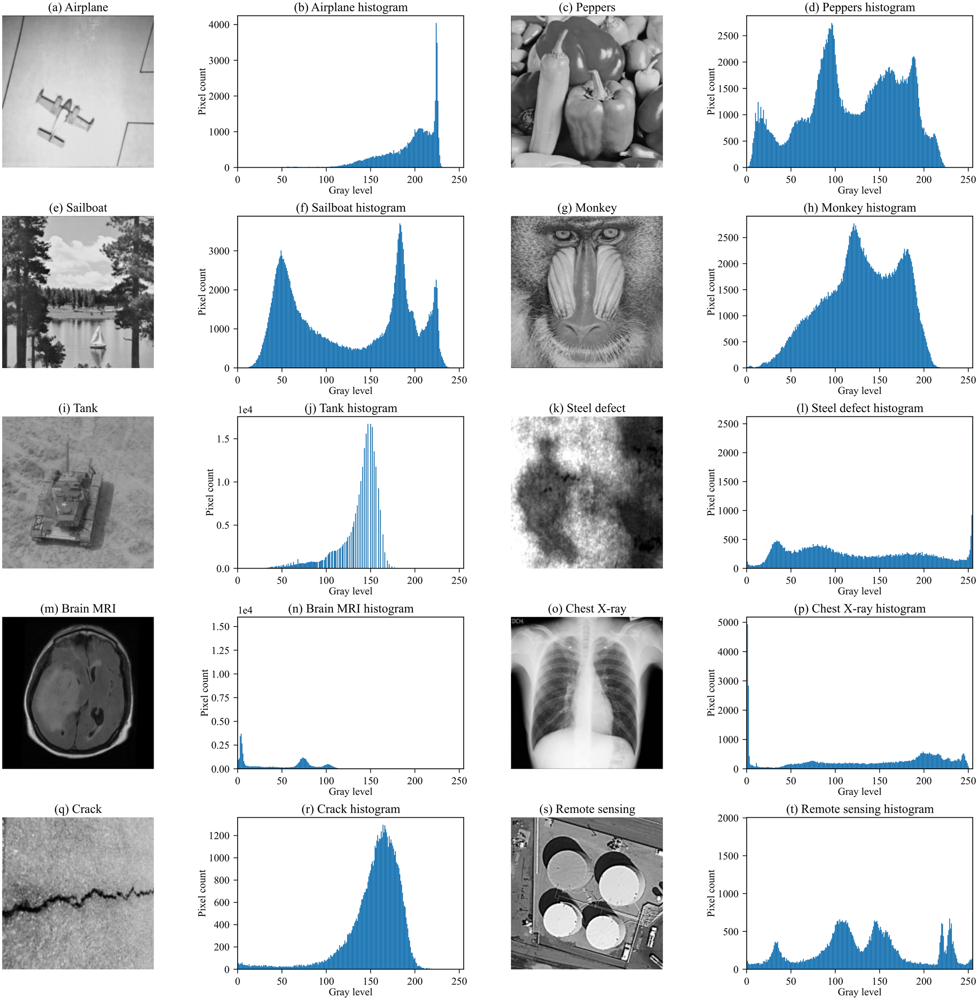
</p>

<p align="center">
  <em><b>图 9.</b> 十幅测试图像及其灰度直方图。该集合同时覆盖经典基准图与应用导向图像，其灰度分布与结构特征差异显著。</em>
</p>

**结果。** AUGO 在 **D = 4 时于 10 幅图像中的 7 幅**取得最高平均最终熵，在 **D = 6 时于 6 幅**取得最高。在低阈值数下，领先算法的最终熵几乎一致——当目标地形相对平滑时，这本就是预期之中的现象。**自 D = 8 起，在每个测试的阈值数下，AUGO 均在全部十幅图像上取得最高平均最终熵。** 其平均重建指标随 `D` 单调改善：

| 阈值数 | 平均 PSNR (dB) | 平均 MSE | 平均 MaxAE | 平均 SSIM | 平均 FSIM | 平均耗时 (s) |
|:--|:--:|:--:|:--:|:--:|:--:|:--:|
| D = 2 | 14.976 | 2125.827 | 102.5 | 0.5530 | 0.6923 | 0.433 |
| D = 20 | 31.253 | 50.419 | 19.0 | 0.9375 | 0.9716 | 1.151 |

运行耗时保持温和，且实际增长呈次线性：AUGO 仍快于 GO 与 GSK，与 JADE、CEO、DE/rand/1 处于同一量级。

<p align="center">
  
</p>

<p align="center">
  <em><b>图 10.</b> AUGO 在测试集上以 20 阈值生成的 Kapur 重建结果。</em>
</p>

这里的结论是**刻意设限**的。AUGO 在最终 Kapur 熵上的优势**随 `D` 增大而显现**；在低维阈值分割问题上，它与对比算法*相当*，而非占优。此外，由于保真度指标是由最大化 Kapur 熵的阈值向量计算而来，它们不必同时最优——熵最高的解在某一图像上的 PSNR 或 SSIM 可能略逊。证据支持的是：AUGO 在实际被优化的那个目标上具备强竞争力，而非在每一项保真度指标上全面领先。

### 带约束的三维无人机路径规划

十个中间航点构成 30 维决策向量，所有坐标约束在 [0, 100]。一条共享的解码链把任意候选解映射为可飞行轨迹：航点按自起点至终点的投影进度排序，以**分段三次 Hermite 插值**连接，按弧长均匀重采样，并进行确定性修复——任何违反最小对地 clearance 的航点或插值采样点都会被抬升 2 个单位的余量。所有对比算法共用同一套解码、排序、插值、重采样与修复流程，因此对比隔离出的正是**搜索能力**本身。

名义代价由七项构成——路径长度、对地高度、平滑度、球形障碍惩罚、威胁区惩罚、转弯/爬升角可行性、高度变化——权重取 `(λ_h, λ_s, λ_o) = (250, 8, 5000)` 与 `(λ_t, λ_a, λ_z) = (2500, 800, 1.2)`。当任一违反计数非零时附加可行性惩罚 `P_fea`，其中 `B = 10⁷`，系数为 `ρ_c = 2×10⁵`、`ρ_v = 5×10⁴`、`ρ_t = 10⁵`、`ρ_q = 10³`、`ρ_n = 10⁻³`。硬性限制包括最小对地 clearance 8、最大转弯角 80°、最大爬升角 35°，地形网格为 121×121。

**实验设置。** 四个约束复杂度递增的确定性场景：S1（3 个球形障碍、2 个威胁区）、S2（8 个障碍、5 个威胁）、S3（单一受限通道、8 个障碍、2 个威胁）、S4（多条备选走廊、8 个障碍、4 个威胁）。种群 60、评估预算 60,000、每场景独立运行 30 次——即每个算法 120 次验证运行。优化过程中目标以 200 个弧长采样点评估，随后对每个入选解以 **2000 个采样点**做确定性**密集复核**；转弯角与爬升角在固定的 200 点网格上检查。**仅当所有违反计数均为零时，该路径才计为成功。** 采用种子配对（基准种子 20260604），成功率用精确配对 McNemar 检验（含 Wilson 95% 置信区间），代价与长度用精确配对符号检验，在各检验族内做 Holm 校正，`α = 0.05`。环境为 MATLAB R2024b。

| 算法 | 可行数 | 成功率 (%) | Wilson 95% CI | 代价中位数 | 长度中位数 | 平均违反数 | 平均耗时 (s) | 平均配对秩 |
|:--|:--:|:--:|:--:|:--:|:--:|:--:|:--:|:--:|
| **AUGO** | **76/120** | **63.33** | [54.42, 71.42] | 186.39 | 164.40 | 5.24 | 123.49 | **2.53** |
| GO | 68/120 | 56.67 | [47.73, 65.19] | 219.09 | 179.18 | 16.13 | 131.62 | 3.36 |
| JADE | 63/120 | 52.50 | [43.63, 61.22] | 243.08 | 191.15 | **4.37** | 130.37 | 3.61 |
| GSK | 53/120 | 44.17 | [35.60, 53.10] | **173.12** | **157.84** | 24.08 | 127.39 | 3.63 |
| DE/rand/1 | 62/120 | 51.67 | [42.81, 60.42] | 187.69 | 164.90 | 27.19 | **116.45** | 3.63 |
| CEO | 42/120 | 35.00 | [27.05, 43.88] | 244.76 | 192.75 | 26.42 | 128.21 | 4.23 |

AUGO 取得最高的汇总成功率与最低的平均配对秩。在场景层面，它在**最难、最开放**的问题上表现最强：在提供多条备选走廊的 S4 中达到观测到的最高成功率 60.00%；在严重受限的 S3 中，它是仅有的两个（与 JADE，均为 16.67%）能产出通过密集复核的路径的算法之一——GSK 与 DE/rand/1 未能产出任何一条。经 Holm 校正的配对检验下，AUGO 的成功率优势在 S2 相对 CEO 显著（+63.33 个百分点，`p = 4.20×10⁻⁴`），在 S4 相对 GSK 显著（+53.33 个百分点，`p = 7.65×10⁻³`）；在 S1 中，其可行路径代价显著低于 GO（`Δ = −28.32`，`p = 3.12×10⁻²`）、JADE（`Δ = −35.08`，`p = 4.66×10⁻³`）与 CEO（`Δ = −61.99`，`p = 1.20×10⁻²`），路径长度也显著短于 GO（`Δ = −22.68`，`p = 7.32×10⁻³`）。

这些优势**并不均匀**，表格本身也说明了原因。**AUGO 未达到完全可行**：在 S1 中 JADE 于 30 次运行中成功 29 次，而 AUGO 为 28 次；在 S2 中 GSK 与 DE/rand/1 均达 86.67%，高于 AUGO 的 83.33%。跨场景汇总后，GSK 取得最低的代价中位数与长度中位数，JADE 的平均违反数最少。在一项经 Holm 校正的反向结果中，GSK 在 S1 的可行路径代价显著**低于** AUGO（`Δ = +20.91`，`p = 1.20×10⁻²`）。该实验所支持的是：AUGO 在确定性密集复核下具备有竞争力的、鲁棒的表现，且在更难、更开放的场景中尤为有效——而**不是**它在每个场景的每项指标上都占优。

<p align="center">
  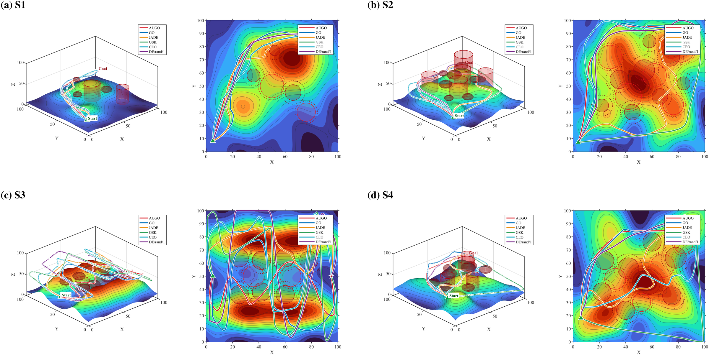
</p>

<p align="center">
  <em><b>图 11.</b> 四个场景下的代表性可行路径。这些是选自若干次运行的解，用于展示典型路径几何形态，而非运行间分布。</em>
</p>

<p align="center">
  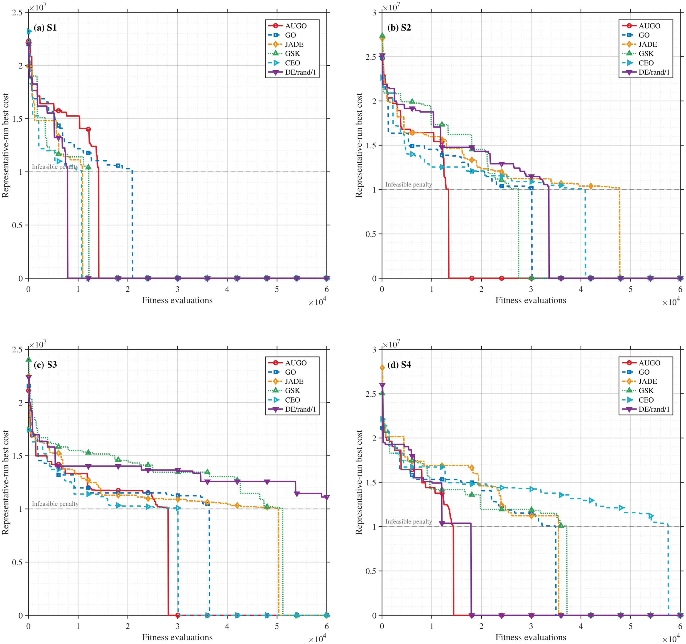
</p>

<p align="center">
  <em><b>图 12.</b> 共享解码链下的收敛行为。该曲线提供的是搜索行为的定性证据，而非收敛优越性的统计证据。</em>
</p>


## 7. 参考实现

参考实现是单个自包含的 MATLAB 函数，除调用方提供的目标函数外无任何外部依赖。它支持两种参数布局并自动识别：11 参数的基准测试接口与 8 参数的分割接口。

```matlab
% --- 基准测试接口（CEC / PlatECO）--------------------------------------
% AUGO(mainHandle, popsize, dimension, xmax, xmin, vmax, vmin, ...
%      maxiter, Func, FuncId, VisualSwitch)
%
% MaxFEs 在文件内设为 popsize * maxiter，因此 N = 40 配合
% maxiter = 7500 即可复现 D = 30 时的 10000*D 评估预算。
[gbestX, gbestfitness, gbesthistory] = AUGO( ...
    [], 40, 30, 100, -100, [], [], 7500, @myObjective, 1, false);

% --- 分割接口 ----------------------------------------------------------
% AUGO(popsize, dimension, maxiter, xmax, xmin, probR, Func, Class)
%
% 目标函数在内部按最大化处理，故 Func 返回 Kapur 熵。
% popsize = 40 配合 maxiter = 150 即可复现分割研究中的 6000 次评估预算。
[gbestX, gbestfitness, gbesthistory] = AUGO( ...
    40, D, 150, 255, 0, probR, @kapurObjective, imageClass);
```

<details>
<summary><b>点击展开 <code>AUGO.m</code> 完整源码（含内联文档）</b></summary>


```matlab
function [gbestX, gbestfitness, gbesthistory] = AUGO(varargin)
% =========================================================================
%  AUGO -- Asymmetric Undulatory Growth Optimizer
%
%  Reference implementation of the algorithm described in the manuscript:
%    "AUGO: An Asymmetric Undulatory Growth Optimizer for Continuous
%     Optimization"
%
%  The manuscript is currently UNDER REVIEW at a peer-reviewed journal.
%  The journal name is withheld for the duration of the review process.
%  This citation record will be updated once the review concludes.
%
%  Copyright (c) 2026  Qingke Zhang
%  School of Computer Science and Artificial Intelligence
%  Shandong Normal University, Jinan 250358, China
%
%  Released under the MIT License. See the LICENSE file in the repository
%  root for the full text. If you use this code in academic work, please
%  cite the manuscript above (see also CITATION.cff).
%
%  Version : V1.0
%  Updated : 2026-09-17
%
% -------------------------------------------------------------------------
%  Interface
%    AUGO is called through varargin and accepts two argument layouts,
%    detected automatically by parseInputs:
%
%      Benchmark (CEC / PlatECO):
%        AUGO(mainHandle, popsize, dimension, xmax, xmin, vmax, vmin, ...
%             maxiter, Func, FuncId, VisualSwitch)
%
%      Image segmentation:
%        AUGO(popsize, dimension, maxiter, xmax, xmin, probR, Func, Class)
%
%  Design notes
%    AUGO retains the learning--reflection framework of the Growth Optimizer
%    (GO) and adds three mechanisms: UADSAP (Undulatory Annealing Dynamic
%    State-Aware Pool), AT-CQ (Asymmetric Time-varying Reflection and Cauchy
%    Quantum Escape), and UDGF (Unified Differential-Gaussian Field).
%
%    MaxFEs is computed as popsize * maxiter rather than hard-coded, so the
%    benchmark configuration (N = 40, a 10000*D function-evaluation budget)
%    is reproduced by passing maxiter = 250*D. For the segmentation setting,
%    popsize = 40 with maxiter = 150 reproduces the 6000-evaluation budget.
%
%    Default parameters: rho_p = 0.5, p_q^max = 0.10, eta_B = 0.20, K = 5.
%
%    Note: this file releases a snapshot of the implementation that
%    accompanies the submitted manuscript. Any code or results released
%    after the review process concludes should be treated as authoritative.
% =========================================================================
% AUGO: Asymmetric Undulatory Growth Optimizer.
% Supports both interfaces:
%   PlatECO/CEC: AUGO(mainHandle,popsize,dimension,xmax,xmin,vmax,vmin,maxiter,Func,FuncId,VisualSwitch)
%   Segmentation: AUGO(popsize,dimension,maxiter,xmax,xmin,probR,Func,Class)
%
% The search core keeps the original AUGO stages. The only added mechanism
% is a small generic best-neighborhood refinement, which is not
% threshold-specific and can also work for CEC functions.

[popsize, dimension, maxiter, xmax, xmin, Fitness, isMinimize, outputBest] = parseInputs(varargin{:});

FEs = 0;
MaxFEs = popsize * maxiter;
printStep = max(1, floor(MaxFEs / 10));

x = xmin + (xmax - xmin) .* rand(popsize, dimension);
fitness = zeros(popsize, 1);
gbesthistory = nan(1, MaxFEs);
```

</details>

完整源码位于仓库根目录的 `AUGO.m`。默认参数为 `ρ_p = 0.5`、`p_q^max = 0.10`、`η_B = 0.20`、`K = 5`；基准测试协议使用初始种群规模 `N = 40`。


## 8. 致谢

作者感谢编辑与匿名审稿人付出的时间与详细意见，这些意见改进了本文。基金信息将在评审结束后依照论文实际情况补充于此。


## 版权所有

Copyright (c) 2026 Qingke Zhang. All rights reserved.

源代码 `AUGO.m` 以 [MIT 许可证](LICENSE) 发布。本仓库中的论文、图表与文档归作者所有，未经许可不得转载。配套论文目前正在投审稿阶段；在引用信息更新之前，请按「投审稿中的稿件」引用本工作。详见 [NOTICE.md](NOTICE.md)。


<div align="center">
<sub>山东师范大学 计算机与人工智能学院</sub>
</div>
